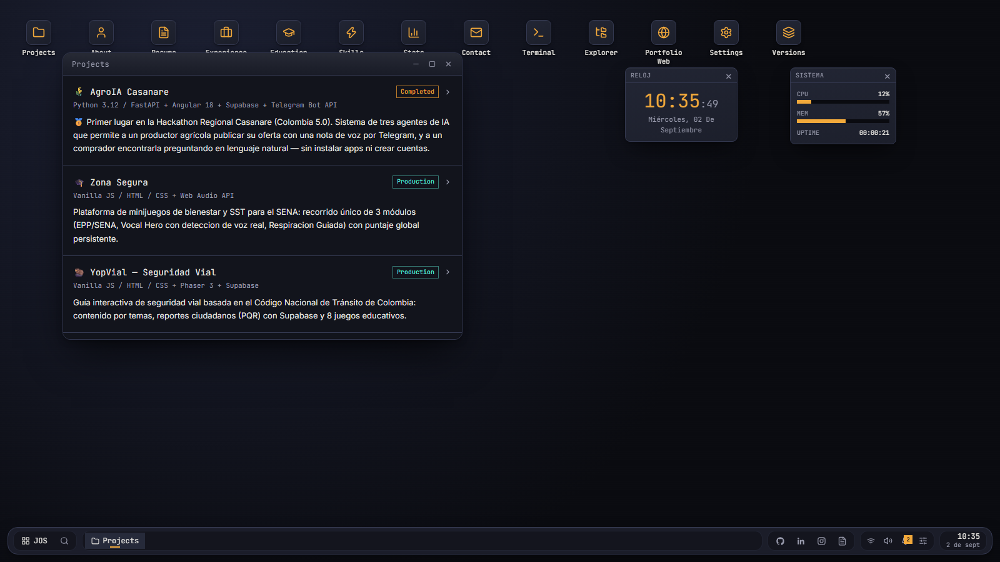
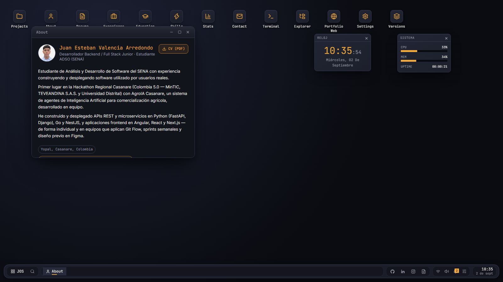
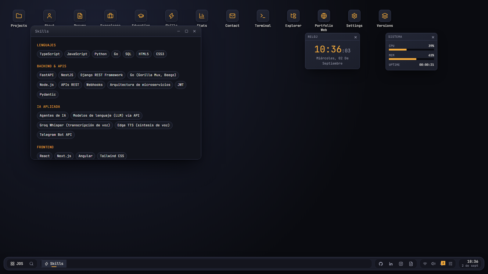
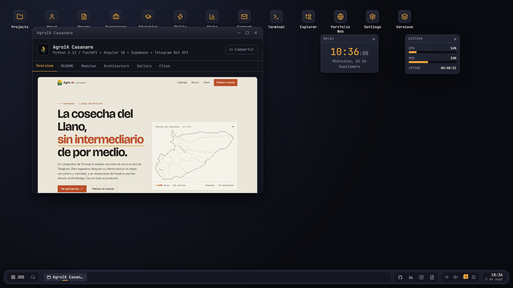
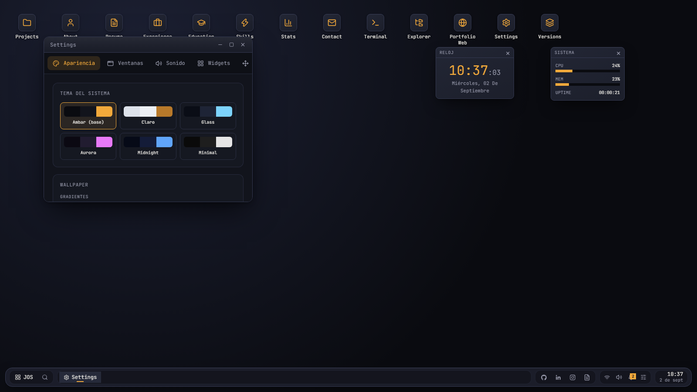

<h1 align="center">JOS — Juan Operating System</h1>

<p align="center">
  Portafolio interactivo con forma de sistema operativo de escritorio.<br>
  Ventanas arrastrables, taskbar, menú inicio, terminal funcional, widgets y easter eggs.
</p>

<p align="center">
  <a href="https://juanezzzzz.github.io/portafolio-personal/"><strong>🖥️ Ver en vivo</strong></a> ·
  <a href="JOS_PROYECTO.md">Documento maestro</a> ·
  <a href="DESPLIEGUE.md">Guía de despliegue</a>
</p>

<p align="center">
  
  
  
  
  
</p>

---

## Vistas

<p align="center">
  <a href="https://juanezzzzz.github.io/portafolio-personal/">
    
  </a>
  <br>
  <em>El escritorio: iconos, widgets, taskbar y la app <strong>Proyectos</strong> con los trabajos reales.</em>
</p>

<table>
  <tr>
    <td width="50%"><br><sub><b>About</b> — bio, foto y CV descargable</sub></td>
    <td width="50%"><br><sub><b>Skills</b> — stack agrupado por categoría</sub></td>
  </tr>
  <tr>
    <td width="50%"><br><sub><b>Proyecto</b> — cada trabajo abre su ventana con pestañas y preview del sitio</sub></td>
    <td width="50%"><br><sub><b>Settings</b> — 6 temas, wallpapers y widgets</sub></td>
  </tr>
</table>

> Las capturas se toman de la versión en vivo. Pruébalo tú:
> [**abrir JOS**](https://juanezzzzz.github.io/portafolio-personal/).

---

## Qué es

En vez de una landing con secciones que se hacen scroll, JOS presenta la misma
información como un sistema operativo: cada parte del portafolio (About,
Proyectos, Experiencia, CV, Terminal...) es una **app** que se abre en su propia
ventana, se puede mover, redimensionar, minimizar, maximizar y apilar.

Es 100 % client-side: no hay backend propio. Todo el contenido vive en
`src/data/` y el sitio se compila a estáticos que sirve GitHub Pages.

Para quien prefiera lo clásico, hay además un **portafolio tradicional** de una
sola página (`src/traditional/`) accesible desde la app *Portfolio Web*.

---

## Arranque rápido

```bash
npm install
npm run dev       # http://localhost:5173
```

| Script | Qué hace |
| --- | --- |
| `npm run dev` | Servidor de desarrollo con HMR |
| `npm run build` | `tsc -b` + build de producción a `dist/` |
| `npm run preview` | Sirve `dist/` respetando el `base` de Pages |
| `npm run lint` | oxlint |

> `npm run preview` abre en `http://localhost:4173/portafolio-personal/` porque
> el `base` de Vite apunta a la subruta de GitHub Pages.

---

## Apps del sistema

| App | Contenido |
| --- | --- |
| **About** | Bio, foto, fortalezas, objetivos, idiomas |
| **Projects** | Grid de proyectos → cada uno abre su propia ventana con pestañas (Overview, README, Módulos, Arquitectura, Galería, Archivos) y badges reales de la API de GitHub |
| **Experience** / **Education** | Historial laboral y formación |
| **Skills** | Stack agrupado por categoría |
| **Stats** | Métricas del perfil de GitHub |
| **Resume** | CV en PDF embebido + descarga |
| **Contact** | Correo, teléfono, redes |
| **Explorer** | Navegador de "archivos" del sistema |
| **Terminal** | Shell con comandos reales sobre los datos del perfil |
| **Settings** | Tema, wallpaper, glass, velocidad de animación, sonido, widgets |
| **Versions** | Historial del sistema narrado como versiones (v1.0 → v5.0) |
| **Portfolio Web** | El portafolio tradicional dentro de una ventana |

### Terminal

```
help · about · projects · skills · experience · education · github · cv
version · contact · date · time · theme · music · matrix · shutdown · clear
```

---

## Personalización

Todo lo configurable por el usuario persiste en `localStorage`:

- **6 temas**: Ámbar (base), Claro, Glass, Aurora, Midnight, Minimal
- **Wallpapers**: 6 degradados + 9 imágenes + subida de imagen propia
- **Efecto glass**, velocidad de animación (slow / normal / fast) y sonidos del sistema
- **Widgets flotantes**: reloj, calendario, clima, notas, música, stats, actividad de GitHub

---

## Detalles que vale la pena mirar

- **Deep links** — `?open=<appId>` abre JOS directo en una app, saltándose el boot.
  Ej.: [`?open=project:yopvial`](https://juanezzzzz.github.io/portafolio-personal/?open=project:yopvial)
- **Buscador global** — abre apps y proyectos desde el teclado
- **Centro de notificaciones** y previews al pasar por la taskbar
- **Boot screen** y **lock screen** con auto-bloqueo por inactividad
- **Onboarding** la primera visita
- **Easter eggs**: `sudo hire juan`, `sudo rm -rf /` → BSOD falso, `matrix`,
  y el código Konami (↑↑↓↓←→←→ b a)

---

## Estructura

```
src/
├── App.tsx                  # boot → lock → escritorio, y resolución de deep links
├── store/                   # Zustand: ventanas, ajustes, notificaciones
├── components/              # Window, Desktop, Taskbar, StartMenu, widgets, overlays
├── apps/                    # una app por ventana (+ apps/project/* con las pestañas)
├── traditional/             # portafolio clásico de una página
├── data/                    # profile · projects · apps · themes · versions · icons
├── hooks/                   # reloj, GitHub, clima, mobile, Konami
└── lib/                     # asset() · deepLink · safeStorage · soundManager
```

### Dónde se edita el contenido

| Archivo | Qué controla |
| --- | --- |
| `src/data/profile.ts` | Datos personales, bio, experiencia, educación, skills, contacto |
| `src/data/projects.ts` | Proyectos: stack, estado, README, módulos, árbol de archivos, capturas |
| `src/data/versions.ts` | Historial de versiones del sistema |
| `src/data/apps.ts` | Registro de apps (icono, título, tamaño por defecto) |
| `public/` | CV, foto, capturas de proyectos, wallpapers |

> **Regla de oro:** cualquier ruta nueva a `/public` debe pasar por
> `asset("/ruta")` — si no, da 404 al servirse bajo la subruta de Pages.
> Detalle completo en [`DESPLIEGUE.md`](DESPLIEGUE.md).

---

## Despliegue

El mismo `main` se publica en dos sitios a la vez:

```
                 ┌─> Vercel ────────> raíz del dominio          (base "/")
push a main ─────┤
                 └─> GitHub Actions ─> Pages, subruta del repo  (base "/portafolio-personal/")
```

Como cada destino sirve el sitio bajo una ruta distinta, `vite.config.ts` lee el
`base` del entorno (`DEPLOY_BASE`) en vez de fijarlo: Vercel compila sin la
variable y queda en `/`; el workflow de Pages la exporta. No se versiona `dist/`
ni existe rama `gh-pages`.

La guía completa (conectar Vercel, verificación, cambio de URL y problemas
frecuentes) está en [`DESPLIEGUE.md`](DESPLIEGUE.md).

---

## Estado del roadmap

| Fase | Estado |
| --- | --- |
| 1 — Esqueleto funcional (ventanas, taskbar, boot) | ✅ |
| 2 — Contenido real | ✅ |
| 3 — Terminal avanzada | ✅ |
| 4 — Temas, wallpapers, widgets, notificaciones, sonido | ✅ |
| 5 — Sistema de versiones evolutivo | ✅ |
| 6 — Juan AI + responsividad + optimización | 🔜 |

La Fase 6 (asistente conversacional) requiere una función serverless con API
key, que GitHub Pages no puede hostear — ver la nota final de `DESPLIEGUE.md`.

---

## Autor

**Juan Esteban Valencia Arredondo** — Fullstack Developer en formación · Yopal, Casanare, Colombia

[GitHub](https://github.com/juanezzzzz) · [LinkedIn](https://linkedin.com/in/juanestebanvalenciaa1111) · juanestebanvalencia.dev@gmail.com
